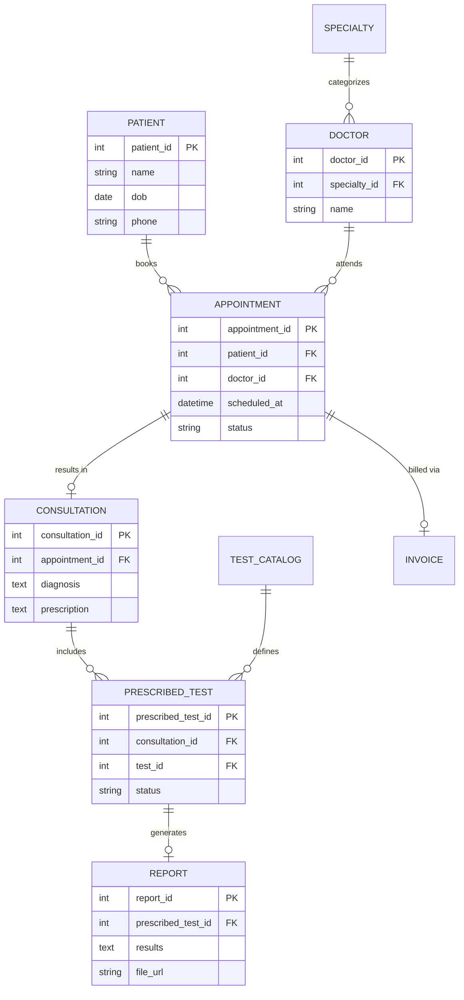

# Clinic-Appointment-and-Diagnostics-Platform-ER-Diagram

# Clinic Management System - Database Design (ERD)

This repository contains the database design for a modern clinic management system. The system is designed to handle the end-to-end workflow from patient registration and appointment scheduling to consultations, diagnostic testing, and billing.

## 📋 Overview of the Workflow

The design focuses on a clean, scalable transition through the following stages:
1. **Appointment:** A patient schedules a time with a specific doctor.
2. **Consultation:** The actual visit. Not every appointment results in a consultation (e.g., no-shows), so these are treated as separate entities.
3. **Diagnostics:** During a consultation, a doctor can prescribe multiple tests. 
4. **Reporting:** Each prescribed test eventually generates a unique diagnostic report.
5. **Billing:** Invoices are generated based on the appointment, capturing both consultation fees and any prescribed test costs.

## 🖼️ ER Diagram

# 📂 Entity Dictionary & Relationships

### 1. Core Entities
* **Patients & Doctors:** These are the primary actors of the system. 
    * A **Doctor** belongs to a **Specialty** (normalized as a separate table) to allow for easy filtering by department and expert type.
* **Appointments:** Acts as the bridge between a Patient and a Doctor. It stores the scheduling metadata and the current status (e.g., *Booked, Cancelled, Completed*).

### 2. Clinical Workflow
* **Consultations:** Linked **1:1** with Appointments. This separation is a key design choice: it ensures that "Cancelled" appointments or "No-Shows" do not create empty or confusing medical history records. Only successful visits trigger a Consultation record.
* **Test_Catalog:** A master lookup table containing all available diagnostic tests and their respective prices.
* **Prescribed_Tests:** This is an intersection table that facilitates the "Many-to-Many" logic between consultations and tests, allowing a single doctor's visit to lead to multiple diagnostic tests.
* **Reports:** Linked **1:1** with a prescribed test. This ensures that every report is explicitly tied to a specific test instance ordered during a visit.

### 3. Financials
* **Invoices:** Tied directly to the **Appointment**. By linking billing to the appointment ID, the clinic can aggregate costs for the base consultation fee as well as any diagnostic tests prescribed during that specific encounter.

---

# 🚀 Key Relationship Summary

| Relationship | Cardinality | Reason |
| :--- | :--- | :--- |
| **Patient → Appointment** | 1 : N | One patient can visit the clinic multiple times. |
| **Doctor → Appointment** | 1 : N | One doctor attends to many patients. |
| **Appointment → Consultation** | 1 : 1 | An appointment leads to exactly one medical record (if attended). |
| **Consultation → Prescribed Test** | 1 : N | A single consultation can result in multiple lab orders. |
| **Prescribed Test → Report** | 1 : 1 | Every specific test eventually generates exactly one result report. |
